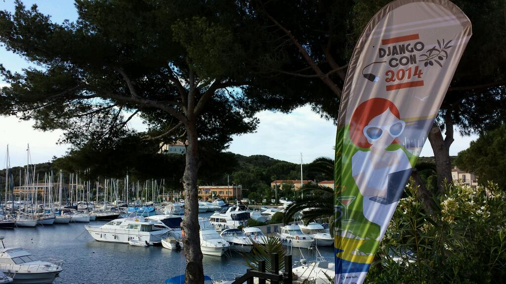
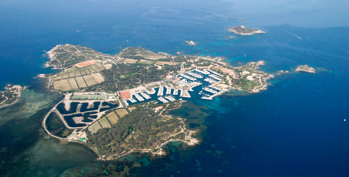
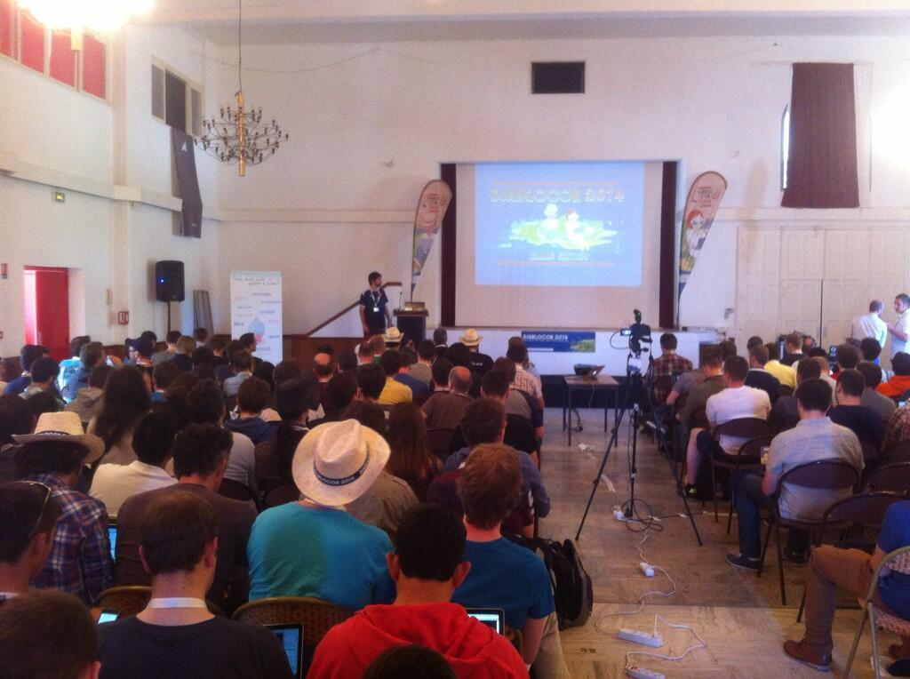
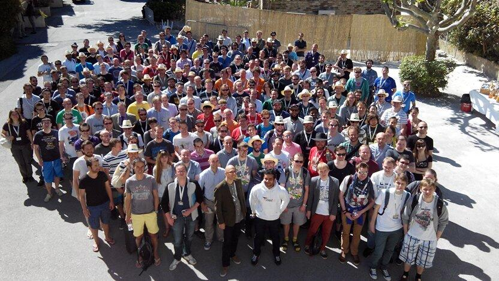

Title: DjangoCon Europe 2014
Date: 2014-05-24
Slug: djangocon-europe-2014
Category: Yazılım

Djangocon Europe bu yıl Fransa’nın Toulon kentinin yakınındaki Embiez adasında yapıldı.

Bu sene orgnaizasyonu ikiye bölmüşler. Üç günlük konferans periyodu ile iki günlük sprint kısmını ayırmışlar.
İki kısım da “her şey dahil” olarak düşünülmüş. Yani konferans katılımı, konaklama ve yemekler dahil. İstemeyen sprint’lere kalmayabiliyor.

Tabii “her şey dahil” yaklaşımı organizasyon kolaylığı, herkesin bir arada olması gibi avantajlar yaratmakla beraber
fiyat dezavantajı doğurmuş. Örneğin konferansın bileti tek başına satılıyor olsaydı, belki de bazı katılımcılar lüks
bir otel yerine airbnb, hostel veya couchsurfing ile konaklayıp daha ucuz bir maliyetle katılabilirlerdi.
İki gece-üç günlük bir konferans için 600€'luk bir maliyettense 200 € ya bu iş çözülebilirdi. Kalantor tayfa varsın Hilton’da kalsın.

Gerçi yer seçimi ile zaten baştan bu ihtimallerin üzeri çizilmiş, çünkü adada alternatif bir konaklama imkanı yok.
Bence django gibi açık kodlu bir platformun konferansına özellikle genç yazılımcıların katılması çok önemli.
Ancak bu pahalı paket program nedeniyle konferansta tanıştığım hemen herkesi “şirketi göndermişti”.

## Île des Embiez

Ada, Toulon’un six fours-les plages bölgesinde bulunuyor. Adından da anlaşılacağı üzere oldukça turistik bir bölgede.
Etkinliğin yapıldığı tarihte deniz suyu sıcaklığı 17 derece olduğundan, henüz sezon başlamamıştı.
Otobüs seferleri seyrek, yollar boş ve dükkanların yarısı kapalı idi.

<iframe src="https://www.google.com/maps/embed?pb=!1m18!1m12!1m3!1d12832.833549393437!2d5.791382752978804!3d43.07754020230995!2m3!1f0!2f0!3f0!3m2!1i1024!2i768!4f13.1!3m3!1m2!1s0x12c900fc41ab5f4d%3A0x93e8837c4f5523a7!2s%C3%8Eles+des+Embiez!5e1!3m2!1str!2s!4v1401138253212" width="620" height="450" frameborder="0" style="border:0"></iframe>

Ada yüzyıllar boyunca bir tuzla olarak kullanılmış. Ardından *olağan olmayan patron* (un patron peu ordinaire) lakaplı
Paul Ricard tarafından satın alınmış. Çok zengin bir doğa aşığı olan Ricard, adayı çorak bir düzlükten bir turizm merkezi haline çevirmiş.
Adaya iki tane otel, 700 teknelik bir marina ve 200 e yakın ev, spor salonu, yaşam kampı vb.. yapmış.
Ancak adanın doğası tamamen korunmuş, hatta iyileştirilmiş. Organik üzüm ve şarap üretimi yapılıyor olduğundan birkaç
elektrikli görev aracı haricinde hiçbir taşıt giremiyor.

Burayı görünce biraz üzüldüm açıkçası. Ülkemizde Bozcaada veya Cunda gibi yüzıllardır yaşam sürülen ve kendi kendine oluşmuş
yaşam alanlarının günde 10 feribot veya köprü ile arabaya boğulması, hatta imar planları değiştirilerek otele ve yoğun
yaşama açıldığı gerçeği ile bu adadaki uyduruk iki ağacın üzerine titrenmesi durumu arasındaki tezat insanı derin düşüncelere itiyor.

Paul Ricard’da kendi adasını evle doldurmayı, otele boğmayı bilirdi herhalde ama aradaki vizyon farkını nasıl,
ne şekilde kapayacağız; kapattığımızda ortada bi ada kalacak mı vb. gibi sorular gereksiz yere moral bozuyor.

Neyse, ada güzel, inşallah sezonunda da gezmek nasip olur. Konferansımıza dönelim.

## Konferans

Ne demiştik, katılımcıların çoğu kalantor, Fransız ve Alman yazılımcılar çoğunlukta. Pazartesi güzel bir akşam yemeğinde,
konferastaki tek Türkler olarak [Üstün Özgür](https://twitter.com/UstunOzgur) ile beraber gözümüze güzel bir masa kestirip oturduk.
Washington Post’un web sitesini geliştiren ekibin masasına oturmuşuz. Türküz dediğimiz an, türkiyeden bir gazetenin kendi
sayfalarını birebir kopyladığını, yapan arkadaşı görürsek “selamlarını” iletmemizi istediler.

Ertesi gün konferans başladı. Bu yazıda konuşmaların detaylarına girmek istemiyorum zira konuşmalar hakkında aldığım
notları ayrı yazılarda paylaşacağım. Burada amacım genel havayı yansıtmak. Tüm konuşma listesine [buradan](http://2014.djangocon.eu/talks/) ulaşabilirsiniz.

DjangoCon’da konuşma aralarında herkes birbiriyle tanışıyor, üzerinde çalıştığı projeleri anlatıyor. Neredeyse tüm organizasyon
buna göre tasarlanmış. Kahve araları, yemekler çok çok uzun. Ben de üzerinde çalıştığımız prism projemizi gördüğüm herkese tanıttım.
Bir yandan da İstanbul'daki python topluluğu olarak bir sonraki organizsyona talip olduğumuzu, fırsat verilirse organizasyonun
altından çok güzel bir şekilde kalkabileceğimizi anlattım. Konuştuğum katılımcılar İstanbul konusunda çok heyecanlıydılar.
Herkes İstanbul’u çok merak ediyor ve İstanbul'da bir konferans fikrine çok açık.

Lakin “can güvenliği sıkıntısı olur mu?” diye soranların sayısı da azımsanmayacak kadar çoktu. Sıkıntı olmadığını belirtsek
de, bir gece önce aynı masada yemek yediğimiz adamların şirketi, yani Washington Post’un twitter hesabından başbakan'ın danışmanınn
iki kolu polis tarafından tutulmuş bir adama uçan tekme attığı görüntünün herkes tarafından görüldüğü bir ortamda bu verdiğimiz güven
telkinleri ne derece etkili oldu bilemiyorum.

Neyse, son gün resmi olarak gelecek seneyi istanbulda yapmak için başvurdum. Akşam üzeri de daha önceki iki senenin
organizasyon komitesi ve django foundation yetkilileri ile birlikte masaya oturduk. Sorguya çekilir gibi, kimsin, nesin,
ne yapıyorsun, kaç kişisiniz İstanbul'da, yapabilir misiniz gibi sorulara mantıklı ve yapabileceklerimiz ölçüsünde cevap verdim.

## Django Eurocon 2015

Toplantının sonunda gelecek sene toplantını İngiltere’de yapılacağı bildirildi. Temel sebebi ingiltere’deki organizsyonu
düzenleyecek arkadaş bu seneki toplantıda aktif görev almış ve “tecrübe kazanmış”. Ben de tebrik ettim kendisini ve
gelecek senenin organizasyonunda görev alarak tecrübe kazanmak istediğimi belirttim. Sonuçlarını hep beraber göreceğiz.
Eğer bu organizsyonu İstanbul’a kazandırabilirsek İstanbul'da djano ve python’a olan ilgiyi arttırabilir,
hem de diğer django’cuları güzel bir şekilde ağırlayarak onlarla daha yakın olabiliriz.

Sonuç olarak benim açımdan oldukça verimli bir toplantı oldu. Gelecek sene Cardiff’deki konferansa da gitmeyi planlıyorum.
Umarım daha uygun bir fiyatla düzenlenir ve böylelikle daha çok insan katılabilir.

