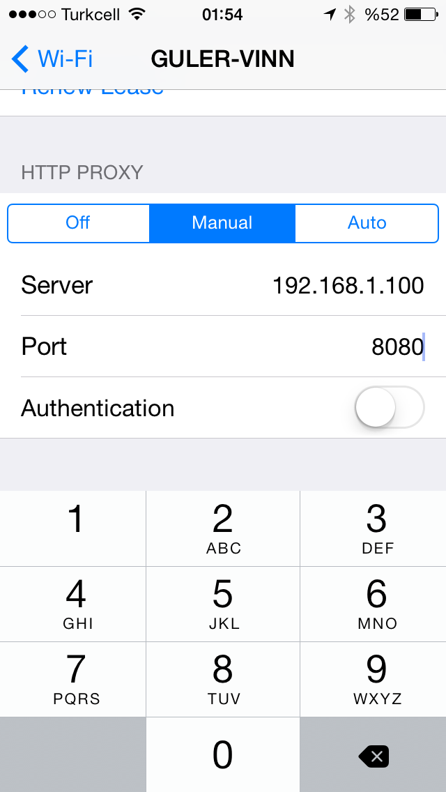
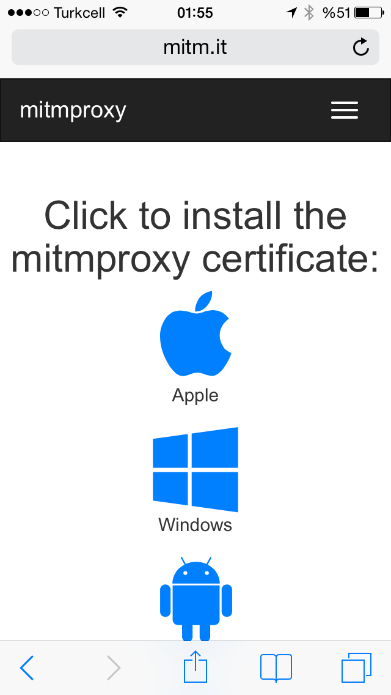
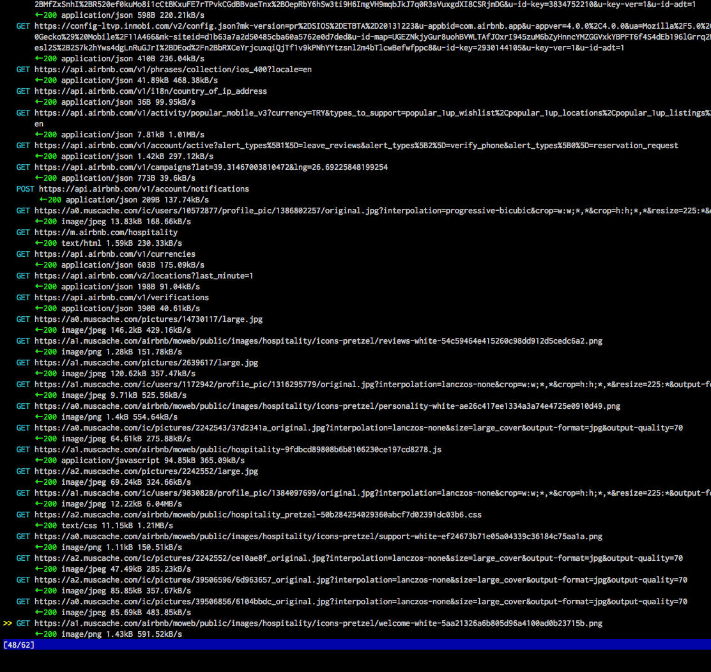

Title: Mitmproxy ile kolayca hata yakalama
Date: 2014-06-09
Slug: mitmproxy
Category: Yazılım
Blurb: API tamamlandı fakat kaynağı belli olmayan bir bug var. Şimdi ne yapmak lazım?
Image: /images/mitmproxy/3.PNG

API yapmak gerçekten çok keyifli bir iş.
Özellikle aylar süren çalışmayla ortaya çıkan uygulamanın ilk sürümünü kurcalamak çok keyifli oluyor.
Kafanızda kurduğunuz veri yapıları, endpointler, hepsi bir anda somut bir nesneye dönüşüyor...

Ancak...

*"Uygulama son güncellemeden sonra **bazen** mesaj göndermez oldu..."*

*"Kullanıcı resimleri gözükmüyor..."*

*"Yapılan değişiklikler kayıt edilmiyor..."*

gibi şikayetler kısa süre sonra kabus halini alıyor.

Çünkü çoğu zaman sorunun API'dan mı yoksa istemci tarafından mı kaynaklandığı anlaşılamıyor.

Endpoint'i curl veya [Postman](http://www.getpostman.com/) ile denediğinizde her şey yolunda gözüküyor.
Telefonu elinize alıp denediğinizde ise hatayla karşılaşıyorsunuz.

Haydi bakalım... Uygulamayı simülatörde açıp kendi lokal sunucunuza yönlendirip istekleri gözetleme olanağınız olsa da hem zahmetli,
hem de -gerçek kullanıcı verisi ile çalışılamadığından- bazı durumlarda çalışmıyor.

"Keşke iPhone ile sunucu arasında gidip gelen istekleri gözetleyebilseydik" dediğim birçok an olmuştu.
Sonunda bir gün [mitmproxy](http://mitmproxy.org/) ile bu kabuslar geride kaldı.

Mitmproxy ne yapıyor?
=====================

Mitmproxy *debugging proxy* adı verilen programlar ailesinin başarılı bir üyesi.
Çalışma mantığı kısaca şöyle **(Telefon ve bilgisayar aynı ağda olmak zorunda)**:

 - Bilgisayarımıza mitmproxy kuruyor ve çalıştırıyoruz::

```
    pip install mitmproxy
    mitmproxy
```

 - Telefonumuza proxy adresi olarak bilgisayarımızın network ip adresini veriyoruz.

<center></center>

 - Telefonumuzdan **mitm.it** adresine girerek güvenlik sertifikasını yüklüyoruz.

 <center></center>

 - Artık telefonumuzun yaptığı tüm http isteklerini ve sunucudan gelen cevapları bilgisayarımızdan gözetleyebiliyoruz.
 İstek hakkında detaylı bilgiye ENTER ve TAB tuşlarıyla ulaşabiliyoruz.

 <center></center>

Hepsi bu kadar!

Bundan sonra uygulama ne istiyor, sunucu ne yolluyor, hepsi elimizin altında.
Hata sunucu tarafındaysa hemen düzeltiyor, istemcide ise ticket'ı ilgili arkadaşa yönlendiriyor ve bir çay koyuyoruz.
